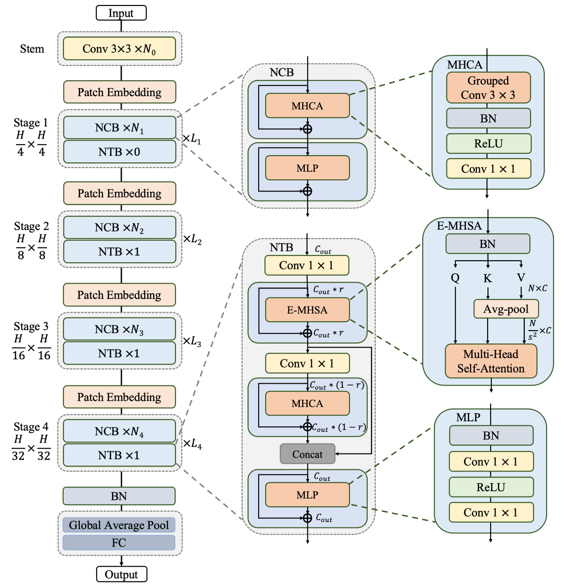
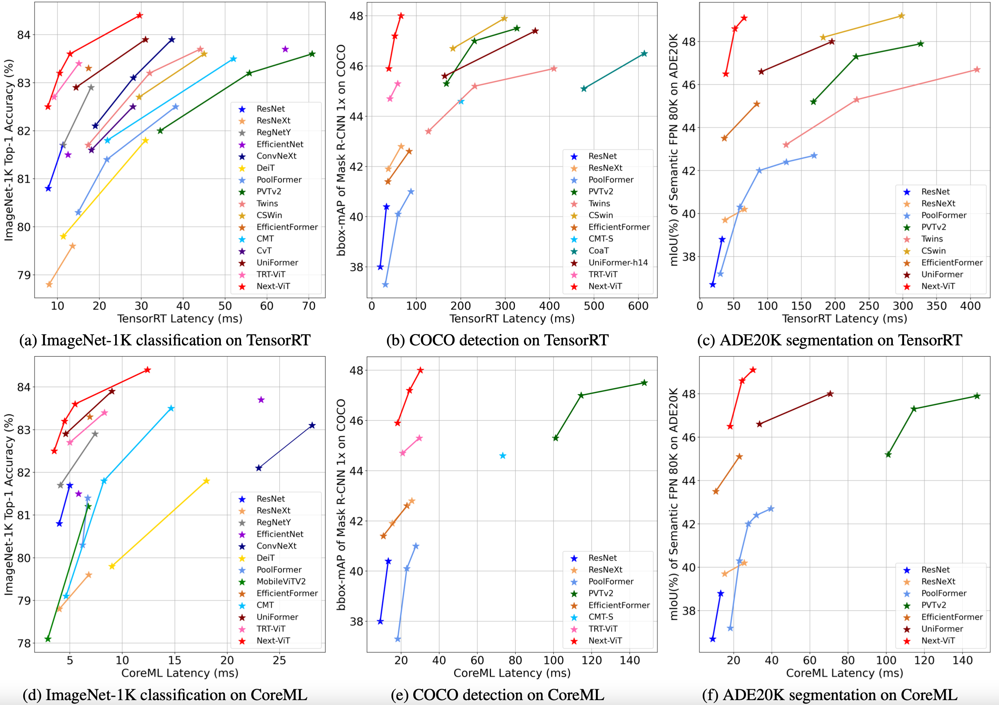
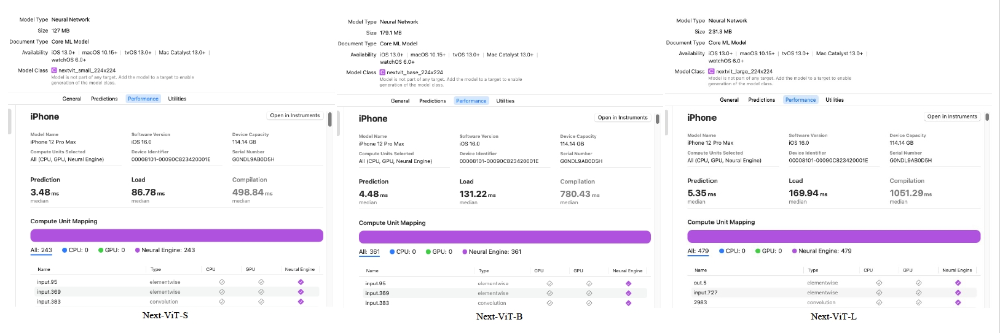

# Next-ViT
This repo is the official implementation of ["Next-ViT: Next Generation Vision Transformer for Efficient Deployment in Realistic Industrial Scenarios"](https://arxiv.org/abs/2207.05501). This algorithm is proposed by ByteDance, Intelligent Creation, AutoML Team (字节跳动-智能创作 AutoML团队).

## Updates


***08/16/2022***

1. Pretrained models on large scale dataset follow [[SSLD]](https://arxiv.org/abs/2103.05959) are provided.
2. Segmentation results with large scale dataset pretrained model are also presented.

## Overview

<div style="text-align: center">

</div>
Figure 1. The overall hierarchical architecture of Next-ViT.</center>

## Introduction
Due to the complex attention mechanisms and model design, most existing vision Transformers (ViTs) can not perform as efficiently as convolutional neural networks (CNNs) in realistic industrial deployment scenarios, e.g. TensorRT and CoreML. This poses a distinct challenge: Can a visual neural network be designed to infer as fast as CNNs and perform as powerful as ViTs? Recent works have tried to design CNN-Transformer hybrid architectures to address this issue, yet the overall performance of these works is far away from satisfactory. To end these, we propose a next generation vision Transformer for efficient deployment in realistic industrial scenarios, namely Next-ViT, which dominates both CNNs and ViTs from the perspective of latency/accuracy trade-off. In this work, the Next Convolution Block (NCB) and Next Transformer Block (NTB) are respectively developed to capture local and global information with deployment-friendly mechanisms. Then, Next Hybrid Strategy (NHS) is designed to stack NCB and NTB in an efficient hybrid paradigm, which boosts performance in various downstream tasks. Extensive experiments show that Next-ViT significantly outperforms existing CNNs, ViTs and CNN-Transformer hybrid architectures with respect to the latency/accuracy trade-off across various vision tasks. On TensorRT, Next-ViT surpasses ResNet by 5.5 mAP (from 40.4 to 45.9) on COCO detection and 7.7% mIoU (from 38.8% to 46.5%) on ADE20K segmentation under similar latency. Meanwhile, it achieves comparable performance with CSWin, while the inference speed is accelerated by 3.6×. On CoreML, Next-ViT surpasses EfficientFormer by 4.6 mAP (from 42.6 to 47.2) on COCO detection and 3.5% mIoU (from 45.1% to 48.6%) on ADE20K segmentation under similar latency.

<center>Figure 2. Comparison among Next-ViT and efficient Networks, in terms of accuracy-latency trade-off.</center>


# Usage

First, clone the repository locally:
```
git clone https://github.com/bytedance/Next-ViT.git
```
Then, install `torch=1.10.0`, `mmcv-full==1.5.0`, `timm==0.4.9` and etc.

```
pip3 install -r requirements.txt
```
## Data preparation

Download and extract ImageNet train and val images from http://image-net.org/.
The directory structure is the standard layout for the torchvision [`datasets.ImageFolder`](https://pytorch.org/docs/stable/torchvision/datasets.html#imagefolder), and the training and validation data is expected to be in the `train/` folder and `val/` folder respectively:

```
/path/to/imagenet/
  train/
    class1/
      img1.jpeg
    class2/
      img2.jpeg
  val/
    class1/
      img3.jpeg
    class/2
      img4.jpeg
```

## Image Classification
We provide a series of Next-ViT models pretrained on ILSVRC2012 ImageNet-1K dataset. More details can be seen in [[paper]](https://arxiv.org/abs/2207.05501).

| Model      |   Dataset   | Resolution | FLOPs(G) | Params (M) | TensorRT <br/>Latency(ms) | CoreML <br/>Latency(ms) | Acc@1 |                                            ckpt                                            |                                    log |
|------------|:-----------:|:----------:|:--------:|------------|:-------------------------:|:-----------------------:|:-----:|:------------------------------------------------------------------------------------------:|---------------------------------------:|
| Next-ViT-S | ImageNet-1K |    224     |   5.8    | 31.7       |            7.7            |           3.5           | 82.5  | [ckpt](https://drive.google.com/file/d/1yoJFpMdnwVseEEnSJxF8CIZ_txn1o_aS/view?usp=sharing) | [log](logs/nextvit_small_in1k_224.log) |
| Next-ViT-B | ImageNet-1K |    224     |   8.3    | 44.8       |           10.5            |           4.5           | 83.2  | [ckpt](https://drive.google.com/file/d/1zaYLlDKMI0OUcYBPoGPXR8lKdrsBq3qp/view?usp=sharing) |  [log](logs/nextvit_base_in1k_224.log) |
| Next-ViT-L | ImageNet-1K |    224     |   10.8   | 57.8       |           13.0            |           5.5           | 83.6  | [ckpt](https://drive.google.com/file/d/15hiQhAu_YNXboVPsbXpuaflfYkodkYZk/view?usp=sharing) | [log](logs/nextvit_large_in1k_224.log) |
| Next-ViT-S | ImageNet-1K |    384     |   17.3   | 31.7       |           21.6            |           8.9           | 83.6  | [ckpt](https://drive.google.com/file/d/1lBBqXFFjWdaPq-zqKyW0uTsToQh43mP_/view?usp=sharing) | [log](logs/nextvit_small_in1k_384.log) |
| Next-ViT-B | ImageNet-1K |    384     |   24.6   | 44.8       |           29.6            |          12.4           | 84.3  | [ckpt](https://drive.google.com/file/d/1D1oZUBHEpWb8uzoRuLs-aFcyjX74zzb3/view?usp=sharing) |  [log](logs/nextvit_base_in1k_384.log) |
| Next-ViT-L | ImageNet-1K |    384     |   32.0   | 57.8       |           36.0            |          15.2           | 84.7  | [ckpt](https://drive.google.com/file/d/1MMGeXeIqrL8UXYuHEFdMArPDd-8L51Ag/view?usp=sharing) | [log](logs/nextvit_large_in1k_384.log) |


We also provide a series of Next-ViT models pretrained on large scale dataset follow [[SSLD]](https://arxiv.org/abs/2103.05959). More details can be seen in [[paper]](https://arxiv.org/abs/2207.05501).

| Model      |    Dataset     | Resolution | FLOPs(G) | Params (M) | TensorRT <br/>Latency(ms) | CoreML <br/>Latency(ms) | Acc@1 |                                            ckpt                                            |
|------------|:--------------:|:----------:|:--------:|------------|:-------------------------:|:-----------------------:|:-----:|:------------------------------------------------------------------------------------------:|
| Next-ViT-S | ImageNet-1K-6M |    224     |   5.8    | 31.7       |            7.7            |           3.5           | 84.8  | [ckpt](https://drive.google.com/file/d/1b7ChnlT3uG3pTaZjtwYtnAaxAESF0MqK/view?usp=sharing) |
| Next-ViT-B | ImageNet-1K-6M |    224     |   8.3    | 44.8       |           10.5            |           4.5           | 85.1  | [ckpt](https://drive.google.com/file/d/1qYtex2EZ23TzVqaFlGh14hAxVjfuILWv/view?usp=sharing) |
| Next-ViT-L | ImageNet-1K-6M |    224     |   10.8   | 57.8       |           13.0            |           5.5           | 85.4  | [ckpt](https://drive.google.com/file/d/1F5iLING3RzNbuZb4RwL7NLZZmJulKW3N/view?usp=sharing) |
| Next-ViT-S | ImageNet-1K-6M |    384     |   17.3   | 31.7       |           21.6            |           8.9           | 85.8  | [ckpt](https://drive.google.com/file/d/104jeld9rJq8vwJ-i-RqlzF3mJzXCcQp9/view?usp=sharing) |
| Next-ViT-B | ImageNet-1K-6M |    384     |   24.6   | 44.8       |           29.6            |          12.4           | 86.1  | [ckpt](https://drive.google.com/file/d/17bCu4EbxOUmhgPCP5wlDH_p8m35oTT38/view?usp=sharing) |
| Next-ViT-L | ImageNet-1K-6M |    384     |   32.0   | 57.8       |           36.0            |          15.2           | 86.4  | [ckpt](https://drive.google.com/file/d/1ZuLswj2xbUdg_t8TugjSJwDsHuIuMSIC/view?usp=sharing) |


#### Training

To train Next-ViT-S on ImageNet  using 8 gpus for 300 epochs, run:

```shell
cd classification/
bash train.sh 8 --model nextvit_small --batch-size 256 --lr 5e-4 --warmup-epochs 20 --weight-decay 0.1 --data-path your_imagenet_path
```
Finetune Next-ViT-S with 384x384 input size for 30 epochs, run:
```shell
cd classification/
bash train.sh 8 --model nextvit_small --batch-size 128 --lr 5e-6 --warmup-epochs 0 --weight-decay 1e-8 --epochs 30 --sched step --decay-epochs 60 --input-size 384 --resume ../checkpoints/nextvit_small_in1k_224.pth --finetune --data-path your_imagenet_path 

```

#### Evaluation 

To evaluate the performance of Next-ViT-S on ImageNet using 8 gpus, run:
```shell
cd classification/
bash train.sh 8 --model nextvit_small --batch-size 256 --lr 5e-4 --warmup-epochs 20 --weight-decay 0.1 --data-path your_imagenet_path --resume ../checkpoints/nextvit_small_in1k_224.pth --eval
```
## Detection
Our code is based on  [mmdetection](https://github.com/open-mmlab/mmdetection), please install `mmdetection==2.23.0`. Next-ViT serve as the strong backbones for
Mask R-CNN. It's easy to apply Next-ViT in other detectors provided by mmdetection based on our examples. More details can be seen in [[paper]](https://arxiv.org/abs/2207.05501).
#### Mask R-CNN
| Backbone   | Pretrained  | Lr Schd | Param.(M) | FLOPs(G) | TensorRT <br/>Latency(ms) | CoreML <br/>Latency(ms) | bbox mAP | mask mAP |                                            ckpt                                            |                    log                     |
|------------|-------------|:-------:|:---------:|:--------:|:-------------------------:|:-----------------------:|:--------:|:--------:|:------------------------------------------------------------------------------------------:|:------------------------------------------:|
| Next-ViT-S | ImageNet-1K |   1x    |   51.8    |   290    |           38.2            |          18.1           |   45.9   |   41.8   | [ckpt](https://drive.google.com/file/d/12epWrFRenpGdiPcXAgzSRoV-hmgsYZ5i/view?usp=sharing) | [log](logs/mask_rcnn_1x_nextvit_small.log) |
| Next-ViT-S | ImageNet-1K |   3x    |   51.8    |   290    |           38.2            |          18.1           |   48.0   |   43.2   | [ckpt](https://drive.google.com/file/d/1LESqQyyaw4iZqHM31ia24Rq8v33q5PP7/view?usp=sharing) | [log](logs/mask_rcnn_3x_nextvit_small.log) |
| Next-ViT-B | ImageNet-1K |   1x    |   64.9    |   340    |           51.6            |          24.4           |   47.2   |   42.8   | [ckpt](https://drive.google.com/file/d/1gptltvAQCaaOdhfgKhjgvke9S_8OYiWO/view?usp=sharing) | [log](logs/mask_rcnn_1x_nextvit_base.log)  |
| Next-ViT-B | ImageNet-1K |   3x    |   64.9    |   340    |           51.6            |          24.4           |   49.5   |   44.4   | [ckpt](https://drive.google.com/file/d/1blDx9nf58kZKWB1XUpQdZDlBRuDGFlmc/view?usp=sharing) | [log](logs/mask_rcnn_3x_nextvit_base.log)  |
| Next-ViT-L | ImageNet-1K |   1x    |   77.9    |   391    |           65.3            |          30.1           |   48.0   |   43.2   | [ckpt](https://drive.google.com/file/d/1-CPrwe4ZtgOCVV9YOzZoQunMUYDmlUgv/view?usp=sharing) | [log](logs/mask_rcnn_1x_nextvit_large.log) |
| Next-ViT-L | ImageNet-1K |   3x    |   77.9    |   391    |           65.3            |          30.1           |   50.2   |   44.8   | [ckpt](https://drive.google.com/file/d/1OIGevcsrAkTmb0hKmBD4iSI_WPdIZ_MA/view?usp=sharing) | [log](logs/mask_rcnn_3x_nextvit_large.log) |

#### Training
To train  Mask R-CNN with Next-ViT-S backbone using 8 gpus, run:
```shell
cd detection/
PORT=29501 bash dist_train.sh configs/mask_rcnn_nextvit_small_1x.py 8
```
#### Evaluation
To evaluate Mask R-CNN with Next-ViT-S backbone using 8 gpus, run:
```shell
cd detection/
PORT=29501 bash dist_test.sh configs/mask_rcnn_nextvit_small_1x.py ../checkpoints/mask_rcnn_1x_nextvit_small.pth 8 --eval bbox
```
## Semantic Segmentation
Our code is based on [mmsegmentation](https://github.com/open-mmlab/mmsegmentation), please install `mmsegmentation==0.23.0`. Next-ViT serve as the strong backbones for segmentation tasks on ADE20K dataset. It's easy to extend it to other datasets and segmentation methods. More details can be seen in [[paper]](https://arxiv.org/abs/2207.05501).

#### Semantic FPN 80k

| Backbone   |   Pretrained   | FLOPs(G) | Params (M) | TensorRT <br/>Latency(ms) | CoreML <br/>Latency(ms) | mIoU | ckpt                                                                                       |                           log                           |
|------------|:--------------:|:--------:|:----------:|:-------------------------:|:-----------------------:|:----:|--------------------------------------------------------------------------------------------|:-------------------------------------------------------:|
| Next-ViT-S |  ImageNet-1K   |   208    |    36.3    |           38.2            |          18.1           | 46.5 | [ckpt](https://drive.google.com/file/d/1AnmFR984FUuTrb5xx-Q1rR7pd0EEZKKL/view?usp=sharing) |          [log](logs/fpn_80k_nextvit_small.log)          |
| Next-ViT-B |  ImageNet-1K   |   260    |    49.3    |           51.6            |          24.4           | 48.6 | [ckpt](https://drive.google.com/file/d/1ts748a9EoMA1QlYzW1PoWYdV0Ec0zk16/view?usp=sharing) |          [log](logs/fpn_80k_nextvit_base.log)           |
| Next-ViT-L |  ImageNet-1K   |   331    |    62.4    |           65.3            |          30.1           | 49.1 | [ckpt](https://drive.google.com/file/d/1XX64ugyL0OV6BeDn1A5UwbvM3nwt6fns/view?usp=sharing) |          [log](logs/fpn_80k_nextvit_large.log)          |
| Next-ViT-S | ImageNet-1K-6M |   208    |    36.3    |           38.2            |          18.1           | 48.8 | [ckpt](https://drive.google.com/file/d/1eDpfMNuLmQUSlMlaPnfkWKZO0N7D5GP-/view?usp=sharing) | [log](logs/fpn_80k_nextvit_small_1n1k6m_pretrained.log) |
| Next-ViT-B | ImageNet-1K-6M |   260    |    49.3    |           51.6            |          24.4           | 50.2 | [ckpt](https://drive.google.com/file/d/18tFAqzMU8Axw8mSKMGVx5guFrJabcwT1/view?usp=sharing) | [log](logs/fpn_80k_nextvit_base_1n1k6m_pretrained.log)  |
| Next-ViT-L | ImageNet-1K-6M |   331    |    62.4    |           65.3            |          30.1           | 50.5 | [ckpt](https://drive.google.com/file/d/1HJpFyWAtd5kZGDCI2Phe_2TkKLjVQ7G8/view?usp=sharing) | [log](logs/fpn_80k_nextvit_large_1n1k6m_pretrained.log) |

#### UperNet 160k 

| Backbone   |   Pretrained   | FLOPs(G) | Params (M) | TensorRT <br/>Latency(ms) | CoreML <br/>Latency(ms) | mIoU(ss/ms) | ckpt                                                                                       |                             log                              |
|------------|:--------------:|:--------:|:----------:|:-------------------------:|:-----------------------:|:-----------:|--------------------------------------------------------------------------------------------|:------------------------------------------------------------:|
| Next-ViT-S |  ImageNet-1K   |   968    |    66.3    |           38.2            |          18.1           |  48.1/49.0  | [ckpt](https://drive.google.com/file/d/1Zi-kW7jQM5Ii1ohmHqTZYSaxUoIzNjTJ/view?usp=sharing) |          [log](logs/upernet_160k_nextvit_small.log)          |
| Next-ViT-B |  ImageNet-1K   |   1020   |    79.3    |           51.6            |          24.4           |  50.4/51.1  | [ckpt](https://drive.google.com/file/d/1n4VgTsGhDg1D5MeDvlGXmwrgZpST2xHm/view?usp=sharing) |          [log](logs/upernet_160k_nextvit_base.log)           |
| Next-ViT-L |  ImageNet-1K   |   1072   |    92.4    |           65.3            |          30.1           |  50.1/50.8  | [ckpt](https://drive.google.com/file/d/1M4_8nQz8F_sinsxeRZvFm7o6b8paSyTz/view?usp=sharing) |          [log](logs/upernet_160k_nextvit_large.log)          |
| Next-ViT-S | ImageNet-1K-6M |   968    |    66.3    |           38.2            |          18.1           |  49.8/50.8  | [ckpt](https://drive.google.com/file/d/181f8aBlCuPnAnmxFERikVElR1W2HSxCG/view?usp=sharing) | [log](logs/upernet_160k_nextvit_small_1n1k6m_pretrained.log) |
| Next-ViT-B | ImageNet-1K-6M |   1020   |    79.3    |           51.6            |          24.4           |  51.8/52.8  | [ckpt](https://drive.google.com/file/d/1TTzJ7wqP00KkzoH16j1T-1CooXMVI0tP/view?usp=sharing) | [log](logs/upernet_160k_nextvit_base_1n1k6m_pretrained.log)  |
| Next-ViT-L | ImageNet-1K-6M |   1072   |    92.4    |           65.3            |          30.1           |  51.5/52.0  | [ckpt](https://drive.google.com/file/d/1_AgzLJ0ieO8cUohmvm2bjN9eYz6dvuSI/view?usp=sharing) | [log](logs/upernet_160k_nextvit_large_1n1k6m_pretrained.log) |


#### Training
To train Semantic FPN 80k with Next-ViT-S backbone using 8 gpus, run:
```shell
cd segmentation/
PORT=29501 bash dist_train.sh configs/fpn_512_nextvit_small_80k.py 8
```
#### Evaluation
To evaluate Semantic FPN 80k(single scale) with Next-ViT-S backbone using 8 gpus, run:
```shell
cd segmentation/
PORT=29501 bash dist_test.sh configs/fpn_512_nextvit_small_80k.py ../checkpoints/fpn_80k_nextvit_small.pth 8 --eval mIoU
```

## Deployment and Latency Measurement
we provide [scripts]() to convert Next-ViT from pytorch model to [CoreML](https://developer.apple.com/documentation/coreml) model and [TensorRT](https://developer.nvidia.com/tensorrt) engine.
#### CoreML
Convert Next-ViT-S to CoreML model with `coremltools==5.2.0`, run:
```shell
cd deployment/
python3 export_coreml_model.py --model nextvit_small --batch-size 1 --image-size 224
```

| Backbone   | Resolution | FLOPs (G) | CoreML <br/>Latency(ms) |                                         CoreML Model                                          |
|------------|:----------:|:---------:|:-----------------------:|:---------------------------------------------------------------------------------------------:|
| Next-ViT-S |    224     |    5.8    |           3.5           | [mlmodel](https://drive.google.com/file/d/1_N7tsHyz4gs7rzNmslqwrzsaGbWhF_MU/view?usp=sharing) |
| Next-ViT-B |    224     |    8.3    |           4.5           | [mlmodel](https://drive.google.com/file/d/15jLWSgDpkVmUCjRVzQZ9_LDT1SAAeGyU/view?usp=sharing) |
| Next-ViT-L |    224     |   10.8    |           5.5           | [mlmodel](https://drive.google.com/file/d/1XEfBDpRYroTnDpOQwLaZbnWdCCGtoK1c/view?usp=sharing) |


We uniformly benchmark CoreML Latency on an iPhone12 Pro Max(iOS 16.0) with Xcode 14.0. The performance report of CoreML model can be generated with Xcode 14.0 directly([new feature](https://developer.apple.com/videos/play/wwdc2022/10027/) of Xcode 14.0).  

<center>Figure 3. CoreML latency of Next-ViT-S/B/L.</center>

#### TensorRT
Convert Next-ViT-S to TensorRT engine with `tensorrt==8.0.3.4`, run:
```shell
cd deployment/
python3 export_tensorrt_engine.py --model nextvit_small --batch-size 8  --image-size 224 --datatype fp16 --profile True --trtexec-path /usr/bin/trtexec
```

## Citation
If you find this project useful in your research, please consider cite:
```
@article{li2022next,
  title={Next-ViT: Next Generation Vision Transformer for Efficient Deployment in Realistic Industrial Scenarios},
  author={Li, Jiashi and Xia, Xin and Li, Wei and Li, Huixia and Wang, Xing and Xiao, Xuefeng and Wang, Rui and Zheng, Min and Pan, Xin},
  journal={arXiv preprint arXiv:2207.05501},
  year={2022}
}
```

## Acknowledgement
We heavily borrow the code from [Twins](https://github.com/Meituan-AutoML/Twins).

## License
This repository is released under the Apache 2.0 license as found in the [LICENSE](LICENSE) file.
